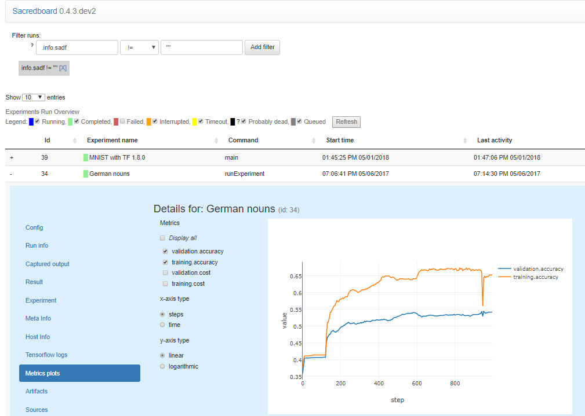

Sacred
======

    | *Every experiment is sacred*
    | *Every experiment is great*
    | *If an experiment is wasted*
    | *God gets quite irate*

|pypi| |py_versions| |license| |doi|

|unix_build| |windows_build| |coverage| |code_quality| |codacy|

Sacred is a tool to help you configure, organize, log and reproduce experiments.
It is designed to do all the tedious overhead work that you need to do around
your actual experiment in order to:

- keep track of all the parameters of your experiment
- easily run your experiment for different settings
- save configurations for individual runs in a database
- reproduce your results

Sacred achieves this through the following main mechanisms:

-  **ConfigScopes** A very convenient way of the local variables in a function
   to define the parameters your experiment uses.
-  **Config Injection**: You can access all parameters of your configuration
   from every function. They are automatically injected by name.
-  **Command-line interface**: You get a powerful command-line interface for each
   experiment that you can use to change parameters and run different variants.
-  **Observers**: Sacred provides Observers that log all kinds of information
   about your experiment, its dependencies, the configuration you used,
   the machine it is run on, and of course the result. These can be saved
   to a MongoDB, for easy access later.
-  **Automatic seeding** helps controlling the randomness in your experiments,
   such that the results remain reproducible.

Example
-------
+------------------------------------------------+--------------------------------------------+
| **Script to train an SVM on the iris dataset** | **The same script as a Sacred experiment** |
+------------------------------------------------+--------------------------------------------+
| .. code:: python                               | .. code:: python                           |
|                                                |                                            |
|  from numpy.random import permutation          |   from numpy.random import permutation     |
|  from sklearn import svm, datasets             |   from sklearn import svm, datasets        |
|                                                |   from sacred import Experiment            |
|                                                |   ex = Experiment('iris_rbf_svm')          |
|                                                |                                            |
|                                                |   @ex.config                               |
|                                                |   def cfg():                               |
|  C = 1.0                                       |     C = 1.0                                |
|  gamma = 0.7                                   |     gamma = 0.7                            |
|                                                |                                            |
|                                                |   @ex.automain                             |
|                                                |   def run(C, gamma):                       |
|  iris = datasets.load_iris()                   |     iris = datasets.load_iris()            |
|  perm = permutation(iris.target.size)          |     per = permutation(iris.target.size)    |
|  iris.data = iris.data[perm]                   |     iris.data = iris.data[per]             |
|  iris.target = iris.target[perm]               |     iris.target = iris.target[per]         |
|  clf = svm.SVC(C, 'rbf', gamma=gamma)          |     clf = svm.SVC(C, 'rbf', gamma=gamma)   |
|  clf.fit(iris.data[:90],                       |     clf.fit(iris.data[:90],                |
|          iris.target[:90])                     |             iris.target[:90])              |
|  print(clf.score(iris.data[90:],               |     return clf.score(iris.data[90:],       |
|                  iris.target[90:]))            |                      iris.target[90:])     |
+------------------------------------------------+--------------------------------------------+

Documentation
-------------
The documentation is hosted at `ReadTheDocs <http://sacred.readthedocs.org/>`_.

Installing
----------
You can directly install it from the Python Package Index with pip:

    pip install sacred

Or if you want to do it manually you can checkout the current version from git
and install it yourself:

   | git clone https://github.com/IDSIA/sacred.git
   | cd sacred
   | python setup.py install

You might want to also install the ``numpy`` and the ``pymongo`` packages. They are
optional dependencies but they offer some cool features:

    pip install numpy, pymongo

Tests
-----
The tests for sacred use the `py.test <http://pytest.org/latest/>`_ package.
You can execute them by running ``py.test`` in the sacred directory like this:

    py.test

There is also a config file for `tox <https://testrun.org/tox/latest/>`_ so you
can automatically run the tests for various python versions like this:

    tox

Frontends
---------
At this point there are two frontends to the database entries created by sacred (that I'm aware of).
They are developed externally as separate projects.

`Sacredboard <https://github.com/chovanecm/sacredboard>`_
+++++++++++++++++++++++++++++++++++++++++++++++++++++++++

Sacredboard is a web-based dashboard interface to the sacred runs stored in a
MongoDB.

`SacredBrowser <https://github.com/michaelwand/SacredBrowser>`_
+++++++++++++++++++++++++++++++++++++++++++++++++++++++++++++++
.. image:: docs/images/sacred_browser.png

SacredBrowser is a PyQt4 application to browse the MongoDB entries created by
sacred experiments.
Features include custom queries, sorting of the results,
access to the stored source-code, and many more.
No installation is required and it can connect to a local
database or over the network.

`Prophet <https://github.com/Qwlouse/prophet>`_
+++++++++++++++++++++++++++++++++++++++++++++++
Prophet is an early prototype of a webinterface to the MongoDB entries created by
sacred experiments, that is discontinued.
It requires you to run `RestHeart <http://restheart.org>`_ to access the database.

Related Projects
----------------

`Sumatra <https://pythonhosted.org/Sumatra/>`_
++++++++++++++++++++++++++++++++++++++++++++++
   | Sumatra is a tool for managing and tracking projects based on numerical
   | simulation and/or analysis, with the aim of supporting reproducible research.
   | It can be thought of as an automated electronic lab notebook for
   | computational projects.

Sumatra takes a different approach by providing commandline tools to initialize
a project and then run arbitrary code (not just python).
It tracks information about all runs in a SQL database and even provides a nice browser tool.
It integrates less tightly with the code to be run, which makes it easily
applicable to non-python experiments.
But that also means it requires more setup for each experiment and
configuration needs to be done using files.
Use this project if you need to run non-python experiments, or are ok with the additional setup/configuration overhead.

`Future Gadget Laboratory <https://github.com/Kaixhin/FGLab>`_
++++++++++++++++++++++++++++++++++++++++++++++++++++++++++++++
   | FGLab is a machine learning dashboard, designed to make prototyping
   | experiments easier. Experiment details and results are sent to a database,
   | which allows analytics to be performed after their completion. The server
   | is FGLab, and the clients are FGMachines.

Similar to Sumatra, FGLab is an external tool that can keep track of runs from
any program. Projects are configured via a JSON schema and the program needs to
accept these configurations via command-line options.
FGLab also takes the role of a basic scheduler by distributing runs over several
machines.

`CDE <https://github.com/pgbovine/CDE/>`_
+++++++++++++++++++++++++++++++++++++++++
By tracing system calls during program execution CDE creates a snapshot of
**all** used files and libraries to guarantee the ability to reproduce any unix
program execution. It *only* solves reproducibility, but it does so thoroughly.

License
-------
This project is released under the terms of the `MIT license <http://opensource.org/licenses/MIT>`_.

.. |pypi| image:: https://img.shields.io/pypi/v/sacred.svg
    :target: https://pypi.python.org/pypi/sacred
    :alt: Current PyPi Version

.. |py_versions| image:: https://img.shields.io/pypi/pyversions/sacred.svg
    :target: https://pypi.python.org/pypi/sacred
    :alt: Supported Python Versions

.. |license| image:: https://img.shields.io/badge/license-MIT-blue.png
    :target: http://choosealicense.com/licenses/mit/
    :alt: MIT licensed

.. |rtfd| image:: https://readthedocs.org/projects/sacred/badge/?version=latest&style=flat
    :target: http://sacred.readthedocs.org/
    :alt: ReadTheDocs

.. |doi| image:: https://zenodo.org/badge/doi/10.5281/zenodo.16386.svg
    :target: http://dx.doi.org/10.5281/zenodo.16386
    :alt: DOI for this release

.. |unix_build| image:: https://img.shields.io/travis/IDSIA/sacred.svg?branch=master&style=flat&label=unix%20build
    :target: https://travis-ci.org/IDSIA/sacred
    :alt: Travis-CI Status

.. |windows_build| image:: https://img.shields.io/appveyor/ci/qwlouse/sacred.svg?style=flat&label=windows%20build
    :target: https://ci.appveyor.com/project/Qwlouse/sacred
    :alt: appveyor-CI Status

.. |coverage| image:: https://coveralls.io/repos/IDSIA/sacred/badge.svg
    :target: https://coveralls.io/r/IDSIA/sacred
    :alt: Coverage Report

.. |code_quality| image:: https://scrutinizer-ci.com/g/IDSIA/sacred/badges/quality-score.png?b=master
    :target: https://scrutinizer-ci.com/g/IDSIA/sacred/
    :alt: Code Scrutinizer Quality

.. |codacy| image:: https://img.shields.io/codacy/acb7bba4467e47deaf260d6df5c0279f.svg?style=flat
    :target: https://www.codacy.com/app/qwlouse/sacred
    :alt: Codacity rating

